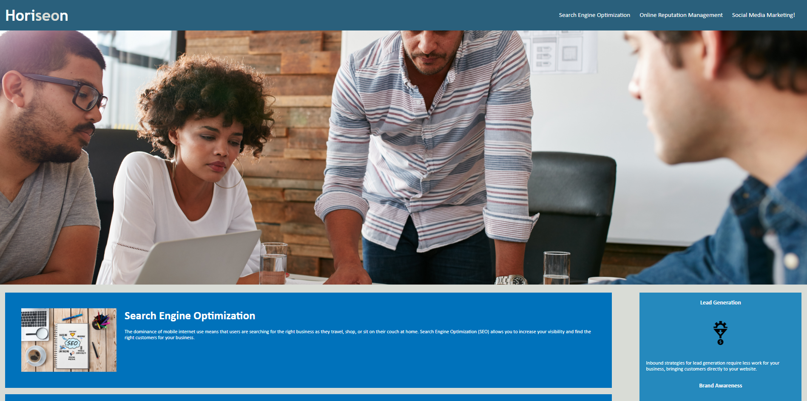

# Horiseon - Webpage

## Description 📑
This webpage focuses on my skills on accessibility in web design. I wanted to challenge myself on how I can make a webpage more accessible to others so more people can access the webpage more easily! Through refactoring this webpage, I learnt about different semantic tags such as ```<header>```, ```<main>```, ```<section>```, ```<aside>``` and ```<footer>```! I also learnt about how to organise my HTML code and CSS so it is more readable for me and others to read later on.

## Why is accessbility important in web design? 😲
Web accessibility is an increasingly important consideration for businesses. 

It ensures that people with disabilities can access a website using assistive technologies such as video captions, screen readers, and braille keyboards. 

Making a website accessible is also good for business for many reasons, one of them being that accessible sites are better positioned in search engines like Google. 

It also helps companies avoid litigation that can occur when people with disabilities cannot access their website.

## What the site looks like 🖥

